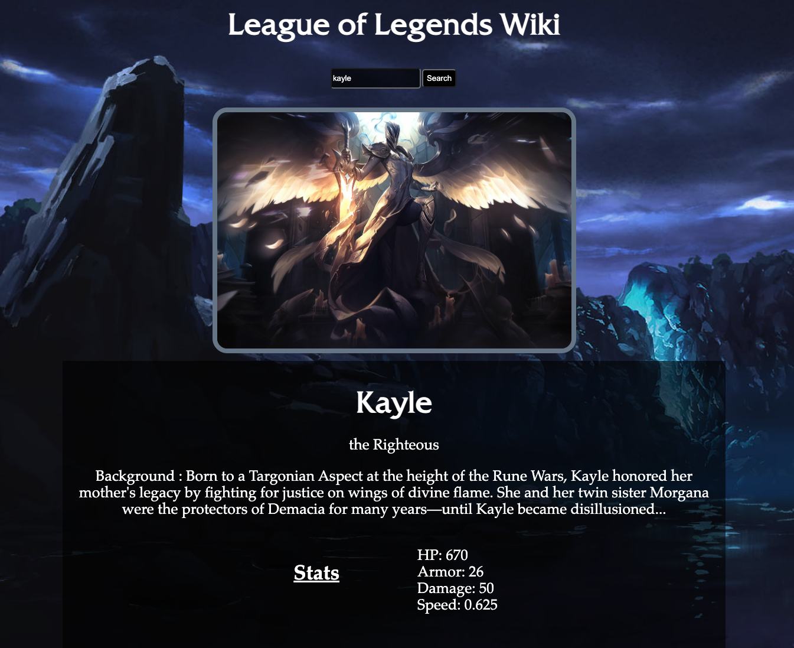

# League-of-Legends-Wiki

A simple tool for you to search up champions based off the game League of Legends. Using this search tool, you are able to find background information on many of the different champions.

Enter the realm of Runeterra, where champions from all over the continent of Valoran rest. 

# Technologies Used

- HTML
- Javascript
- CSS

# Screenshot

# Getting Started

To get started, simply type the name of the Champion you would like to search and press the "search" button. Once pressed, information on the requested Champion will pop with their picture and stats. If a Champion is mispelled you will receive the error "Champion does not exist, try again"

# Future Enhancements

- Add abilities
- Create a redesigned background
- More options for stats info